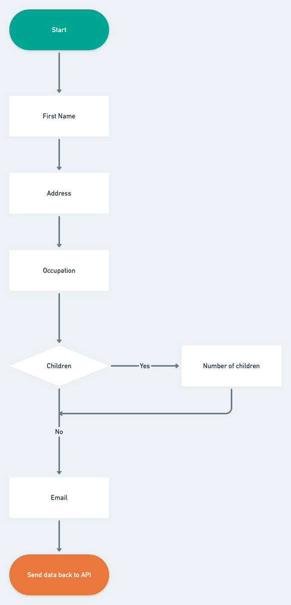
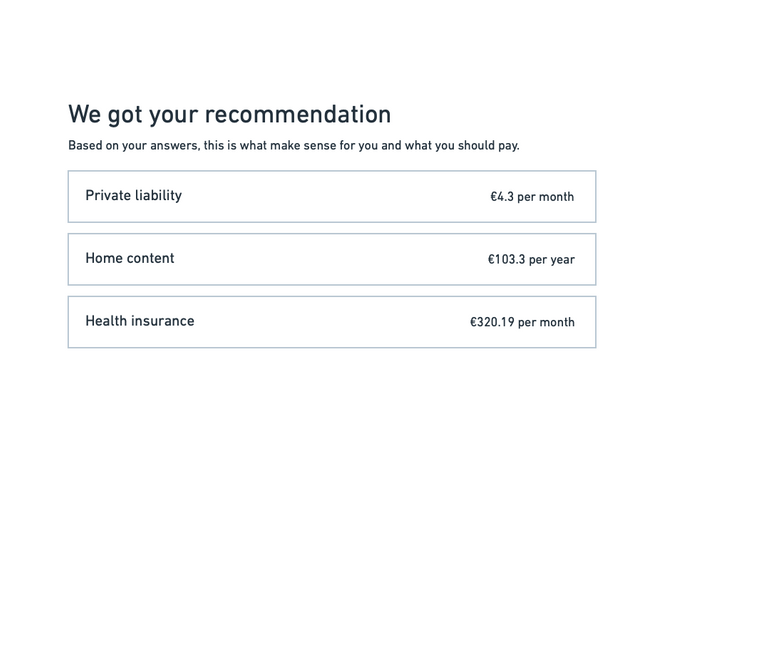

# Feather Code challenge

Learn the [architecture](docs/ARCHITECTURE.md) used.

## Overview

You will design and implement an API that recommends an insurance policy based on a questionnaire answers. 

The API is going to be used by one or more frontend apps. It should be possible to:

1. Create a user account.
    - The response must have an authentication token. We recommend to use [JWT](https://jwt.io/).
2. Submit questionnaire data.
    - The request must carry an authentication token.
    - The request should contain a JSON with all the answers.
    - The answers must be validated. Up to you to decide which validations are necessary.
3. Request recommended insurances.

We won't be judging on the quality of the recommendations, just make sure that it is consistent and corresponds to our offering at [https://feather-insurance.com/](https://feather-insurance.com/).

## Questionnaire

- First name
- Address
- If they have any children (boolean)
  - If yes → How many do they have?
- Their occupation
  - Employed
  - Student
  - Self-employed
- Email address

### Flowchart

## Recommendations

## Response codes and errors

A successful response will have either `200` or `201` status code. A response containing an error will be either `422`, `401` or `500`.

The `422` response should have human readable validation errors.

## Sharing the code

When you're done, please, send us the code and a link to a place where we can play with it. Here's a couple ideas:

- Publish the code on GitHub and provide a README so we can check out and run it. If it's going to be a private repo, don't forget to invite nikolay@feather-insurance.com as a collaborator.
- Host the app somewhere in the cloud. Google Cloud Platform, AWS and Heroku offer free tiers of their products.
- Make sure to provide working examples. Curl is ok, postman is great.

## What we'll be looking at

- How you write idiomatic code.
- How you test & write testable code.
- How you interact with the database.
- How you deal with the security concerns.
- How you communicate with your fellow programmers.
